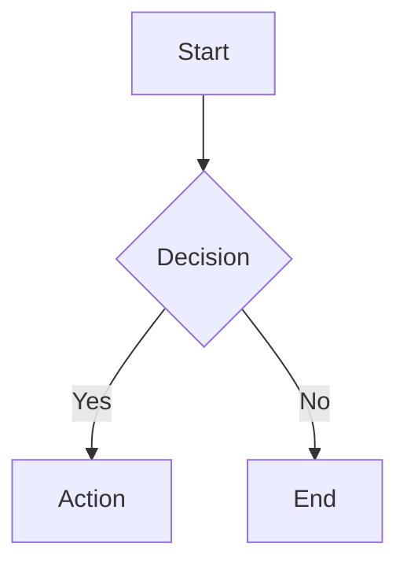

# agentviewer

A localhost web server that allows AI agents (Claude Code, etc.) to display rich content to users in a browser.

## Features

- **Tabbed browser interface** for viewing multiple documents
- **Markdown** with GitHub Flavored Markdown, Mermaid diagrams, and LaTeX math
- **Code** with syntax highlighting (180+ languages)
- **Diffs** with side-by-side comparison view
- **Live updates** via WebSocket - content updates instantly in the browser
- **REST API** for programmatic control by AI agents

```
┌─────────────────┐    WebSocket     ┌─────────────────┐
│  Browser Tab    │◄────────────────►│   agentviewer   │
│  (localhost)    │                  │   HTTP Server   │
└─────────────────┘                  └────────▲────────┘
                                             │ REST API (curl)
                                    ┌────────┴────────┐
                                    │  Claude / Agent │
                                    └─────────────────┘
```

## Installation

### macOS (Homebrew)

```bash
brew tap pengelbrecht/agentviewer
brew install agentviewer
```

### macOS/Linux (Binary)

Download the latest release for your platform:

```bash
# Detect platform and download
curl -L "https://github.com/pengelbrecht/agentviewer/releases/latest/download/agentviewer-$(uname -s | tr '[:upper:]' '[:lower:]')-$(uname -m | sed 's/x86_64/amd64/' | sed 's/aarch64/arm64/')" -o agentviewer
chmod +x agentviewer
sudo mv agentviewer /usr/local/bin/
```

Or download manually from [GitHub Releases](https://github.com/pengelbrecht/agentviewer/releases).

Available binaries:
- `agentviewer-darwin-arm64` - macOS Apple Silicon (M1/M2/M3)
- `agentviewer-darwin-amd64` - macOS Intel
- `agentviewer-linux-amd64` - Linux x86_64
- `agentviewer-linux-arm64` - Linux ARM64
- `agentviewer-windows-amd64.exe` - Windows x86_64

### Go Install

If you have Go 1.22+ installed:

```bash
go install github.com/pengelbrecht/agentviewer@latest
```

### From Source

```bash
git clone https://github.com/pengelbrecht/agentviewer
cd agentviewer
make install
```

This installs to `$GOBIN` (usually `~/go/bin`). Ensure this is in your `PATH`.

## Verify Installation

```bash
agentviewer --version
agentviewer serve --help
```

## Quick Start

1. **Start the server** (opens browser automatically):
   ```bash
   agentviewer serve --open
   ```

2. **Create content via API**:
   ```bash
   curl -X POST http://localhost:3333/api/tabs \
     -H "Content-Type: application/json" \
     -d '{"title": "Hello", "type": "markdown", "content": "# Hello World\n\nThis is **bold** text."}'
   ```

3. **View in browser** at http://localhost:3333

## Usage

### Command Line

```bash
# Start server (foreground, blocks)
agentviewer serve

# Start server and open browser
agentviewer serve --open

# Custom port
agentviewer serve --port 4000

# Start with initial file
agentviewer serve --open README.md
```

### REST API

Base URL: `http://localhost:3333/api`

| Method | Endpoint | Description |
|--------|----------|-------------|
| POST | `/api/tabs` | Create or update a tab |
| GET | `/api/tabs` | List all tabs |
| GET | `/api/tabs/:id` | Get tab content |
| DELETE | `/api/tabs/:id` | Delete a tab |
| DELETE | `/api/tabs` | Delete all tabs |
| POST | `/api/tabs/:id/activate` | Switch to a tab |
| GET | `/api/status` | Server status |

### API Examples

**Create markdown tab:**
```bash
curl -X POST localhost:3333/api/tabs \
  -d '{"title": "Notes", "type": "markdown", "content": "# My Notes\n\n- Item 1\n- Item 2"}'
```

**Show code with syntax highlighting:**
```bash
curl -X POST localhost:3333/api/tabs \
  -d '{"title": "main.go", "type": "code", "file": "/path/to/main.go"}'
```

**Display a diff:**
```bash
curl -X POST localhost:3333/api/tabs \
  -d '{"type": "diff", "diff": {"left": "old.go", "right": "new.go"}}'
```

**Show git changes:**
```bash
git diff HEAD > /tmp/changes.diff
curl -X POST localhost:3333/api/tabs \
  -d '{"title": "Git Changes", "type": "diff", "file": "/tmp/changes.diff"}'
```

## Content Types

| Type | Features |
|------|----------|
| `markdown` | GFM, tables, task lists, Mermaid diagrams, LaTeX math, code blocks |
| `code` | Syntax highlighting for 180+ languages, line numbers |
| `diff` | Side-by-side comparison, syntax highlighting, line numbers |

### Markdown Features

Agentviewer renders GitHub-flavored markdown with extensions:

- **Mermaid diagrams**: Flowcharts, sequence diagrams, ER diagrams, etc.
- **LaTeX math**: Inline `$...$` and block `$$...$$`
- **Code blocks**: Syntax highlighting with language detection
- **Tables, task lists, strikethrough**: Full GFM support

Example with Mermaid:
````markdown

````

## Claude Code Integration

### Using the Skill

If you have the agentviewer skill installed in Claude Code, Claude will automatically use it when you need to display rich content.

Install the skill:
```bash
cp -r skills/agentviewer ~/.claude/skills/
```

### Using the Plugin

For native Claude Code plugin integration:
```bash
claude plugins add --local /path/to/agentviewer
```

See `.claude-plugin/README.md` for more details.

## Development

```bash
# Run during development
go run . serve --open

# Build binary
go build -o agentviewer .

# Run tests
go test ./...

# Run e2e tests
go test -tags=e2e ./...

# Cross-compile all platforms
make build-all
```

See `CLAUDE.md` for detailed development documentation.

## License

MIT
