# Mermaid Diagram Test File

This file tests various Mermaid diagram types for agentviewer rendering.

## 1. Flowchart (Default Direction: Top to Bottom)

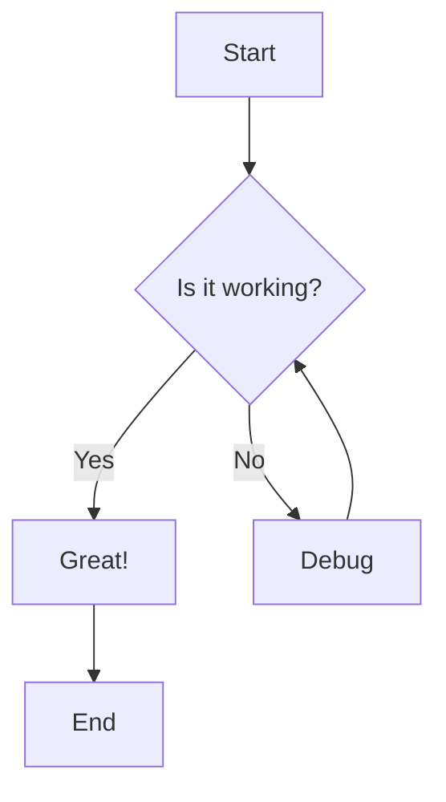
```mermaid
flowchart TB
    A[Start] --> B{Is it working?}
    B -->|Yes| C[Great!]
    B -->|No| D[Debug]
    D --> B
    C --> E[End]
```

## 2. Flowchart (Left to Right)

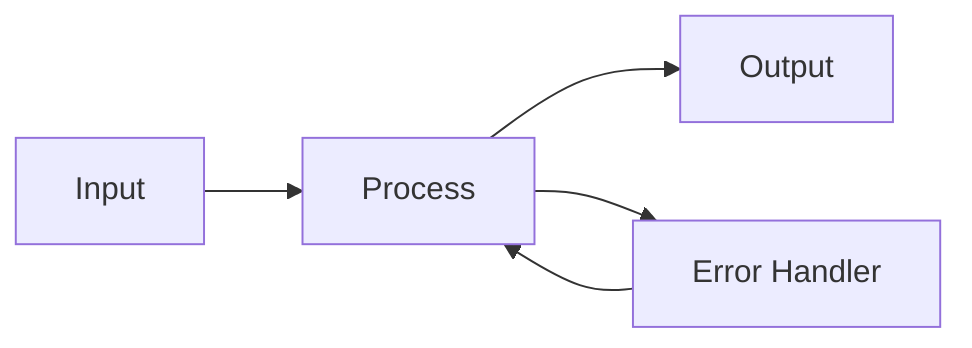
```mermaid
flowchart LR
    A[Input] --> B[Process]
    B --> C[Output]
    B --> D[Error Handler]
    D --> B
```

## 3. Flowchart with Subgraphs

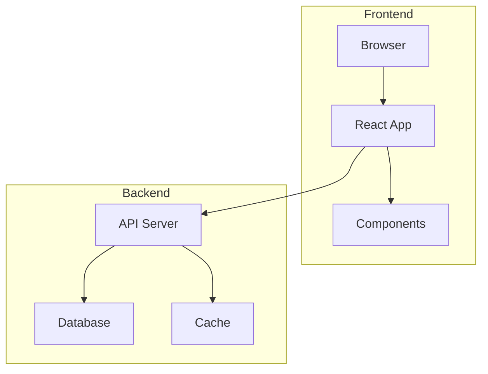
```mermaid
flowchart TB
    subgraph Frontend
        A[Browser] --> B[React App]
        B --> C[Components]
    end
    subgraph Backend
        D[API Server] --> E[Database]
        D --> F[Cache]
    end
    B --> D
```

## 4. Sequence Diagram

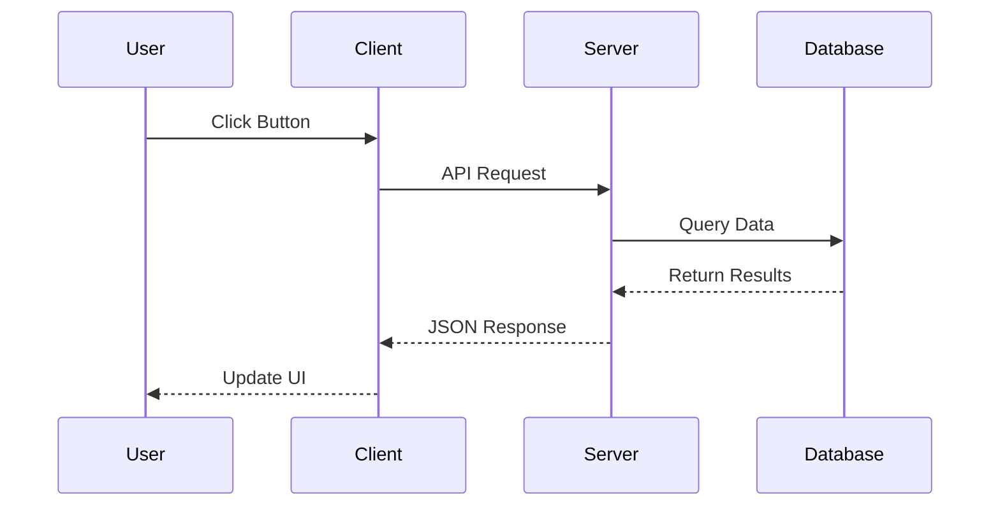
```mermaid
sequenceDiagram
    participant U as User
    participant C as Client
    participant S as Server
    participant D as Database

    U->>C: Click Button
    C->>S: API Request
    S->>D: Query Data
    D-->>S: Return Results
    S-->>C: JSON Response
    C-->>U: Update UI
```

## 5. Sequence Diagram with Loops and Alt

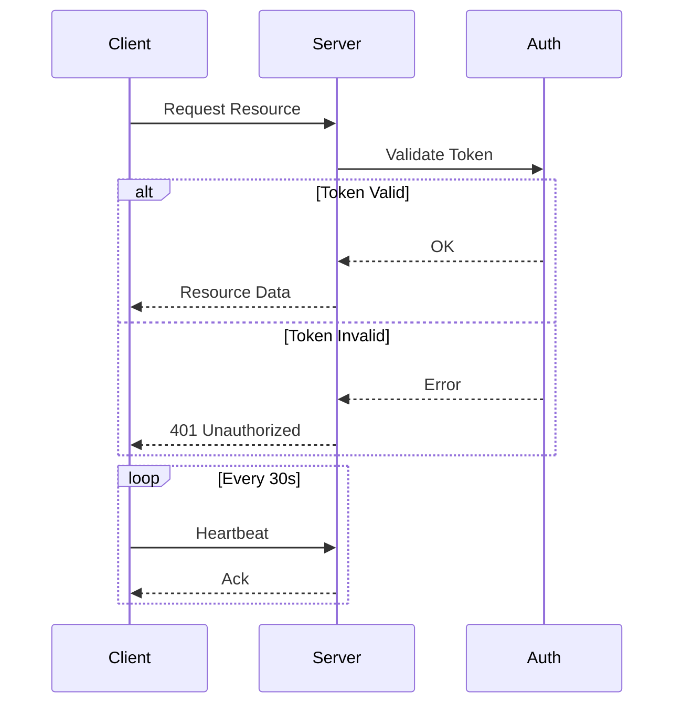
```mermaid
sequenceDiagram
    participant Client
    participant Server
    participant Auth

    Client->>Server: Request Resource
    Server->>Auth: Validate Token
    alt Token Valid
        Auth-->>Server: OK
        Server-->>Client: Resource Data
    else Token Invalid
        Auth-->>Server: Error
        Server-->>Client: 401 Unauthorized
    end

    loop Every 30s
        Client->>Server: Heartbeat
        Server-->>Client: Ack
    end
```

## 6. Class Diagram

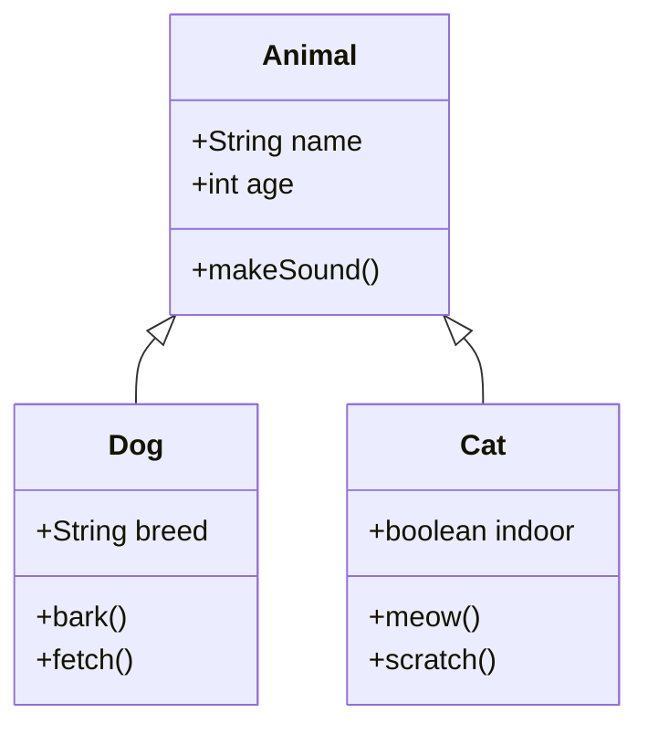
```mermaid
classDiagram
    class Animal {
        +String name
        +int age
        +makeSound()
    }
    class Dog {
        +String breed
        +bark()
        +fetch()
    }
    class Cat {
        +boolean indoor
        +meow()
        +scratch()
    }
    Animal <|-- Dog
    Animal <|-- Cat
```

## 7. Class Diagram with Relationships

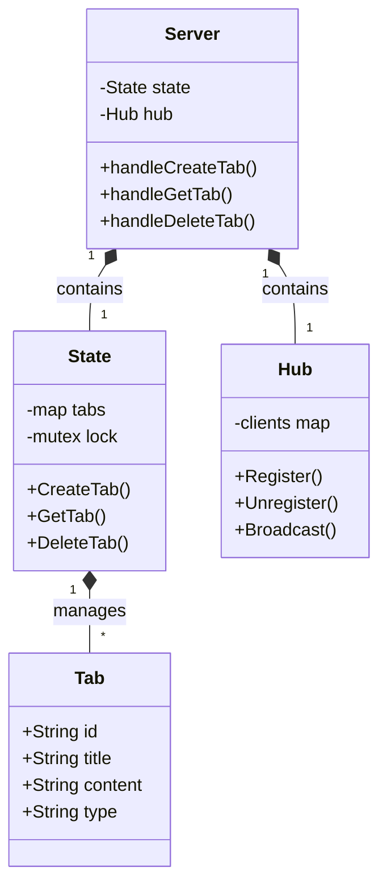
```mermaid
classDiagram
    class Server {
        -State state
        -Hub hub
        +handleCreateTab()
        +handleGetTab()
        +handleDeleteTab()
    }
    class State {
        -map tabs
        -mutex lock
        +CreateTab()
        +GetTab()
        +DeleteTab()
    }
    class Hub {
        -clients map
        +Register()
        +Unregister()
        +Broadcast()
    }
    class Tab {
        +String id
        +String title
        +String content
        +String type
    }
    Server "1" *-- "1" State : contains
    Server "1" *-- "1" Hub : contains
    State "1" *-- "*" Tab : manages
```

## 8. State Diagram

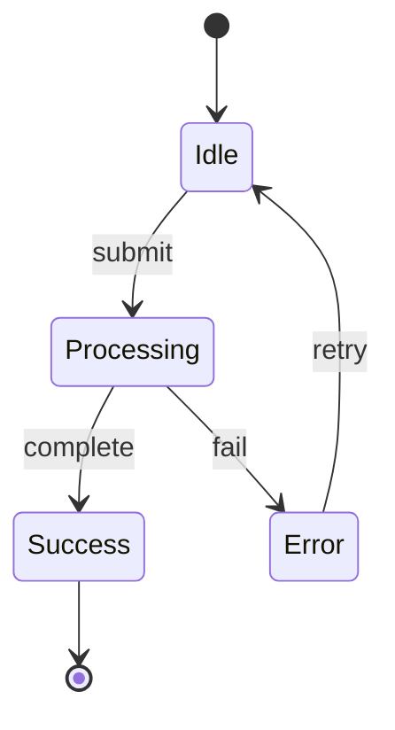
```mermaid
stateDiagram-v2
    [*] --> Idle
    Idle --> Processing : submit
    Processing --> Success : complete
    Processing --> Error : fail
    Error --> Idle : retry
    Success --> [*]
```

## 9. State Diagram with Nested States

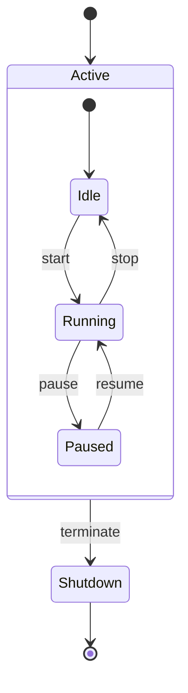
```mermaid
stateDiagram-v2
    [*] --> Active

    state Active {
        [*] --> Idle
        Idle --> Running : start
        Running --> Paused : pause
        Paused --> Running : resume
        Running --> Idle : stop
    }

    Active --> Shutdown : terminate
    Shutdown --> [*]
```

## 10. Entity Relationship Diagram

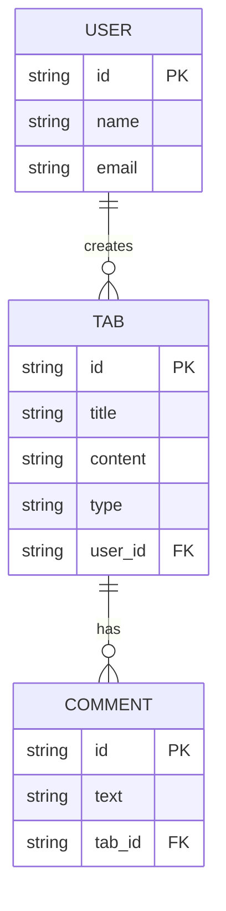
```mermaid
erDiagram
    USER ||--o{ TAB : creates
    USER {
        string id PK
        string name
        string email
    }
    TAB {
        string id PK
        string title
        string content
        string type
        string user_id FK
    }
    TAB ||--o{ COMMENT : has
    COMMENT {
        string id PK
        string text
        string tab_id FK
    }
```

## 11. Gantt Chart

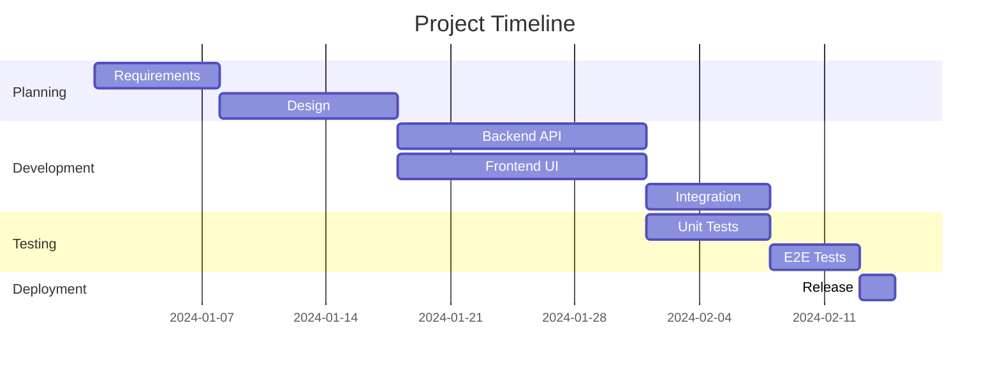
```mermaid
gantt
    title Project Timeline
    dateFormat  YYYY-MM-DD
    section Planning
    Requirements     :a1, 2024-01-01, 7d
    Design           :a2, after a1, 10d
    section Development
    Backend API      :b1, after a2, 14d
    Frontend UI      :b2, after a2, 14d
    Integration      :b3, after b1, 7d
    section Testing
    Unit Tests       :c1, after b1, 7d
    E2E Tests        :c2, after b3, 5d
    section Deployment
    Release          :d1, after c2, 2d
```

## 12. Pie Chart

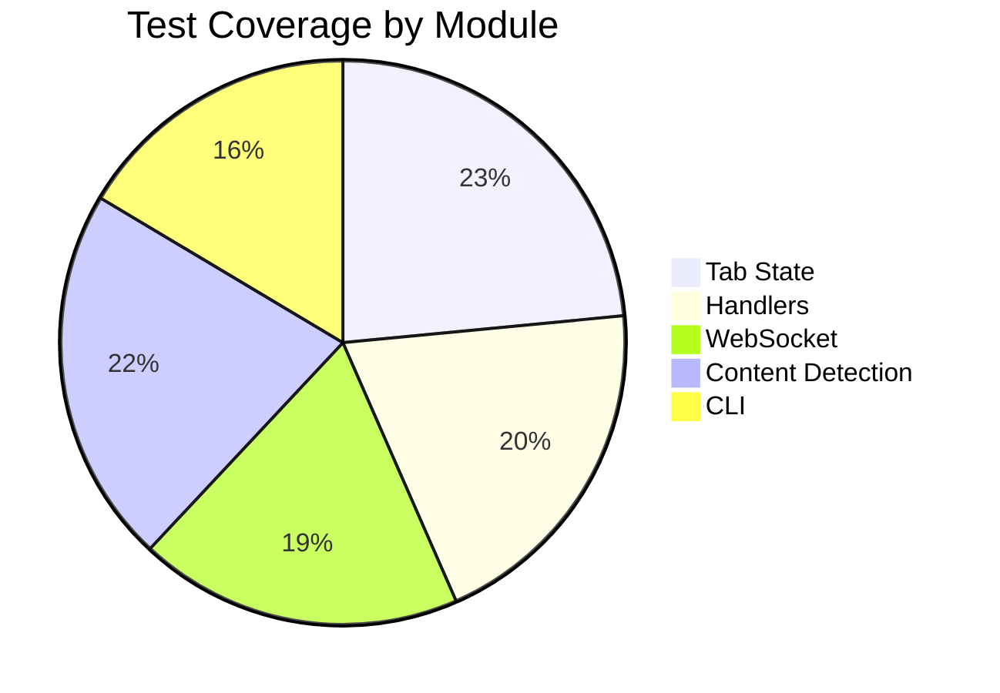
```mermaid
pie title Test Coverage by Module
    "Tab State" : 100
    "Handlers" : 85
    "WebSocket" : 79
    "Content Detection" : 92
    "CLI" : 70
```

## 13. Git Graph

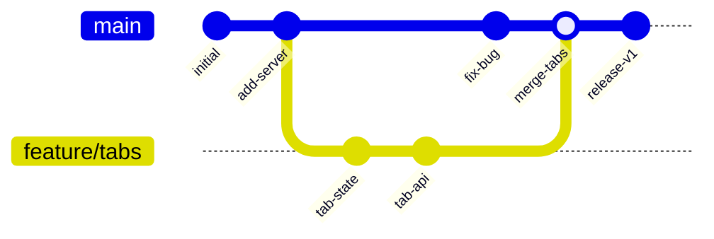
```mermaid
gitGraph
    commit id: "initial"
    commit id: "add-server"
    branch feature/tabs
    commit id: "tab-state"
    commit id: "tab-api"
    checkout main
    commit id: "fix-bug"
    merge feature/tabs id: "merge-tabs"
    commit id: "release-v1"
```

## 14. Journey Diagram (User Journey)

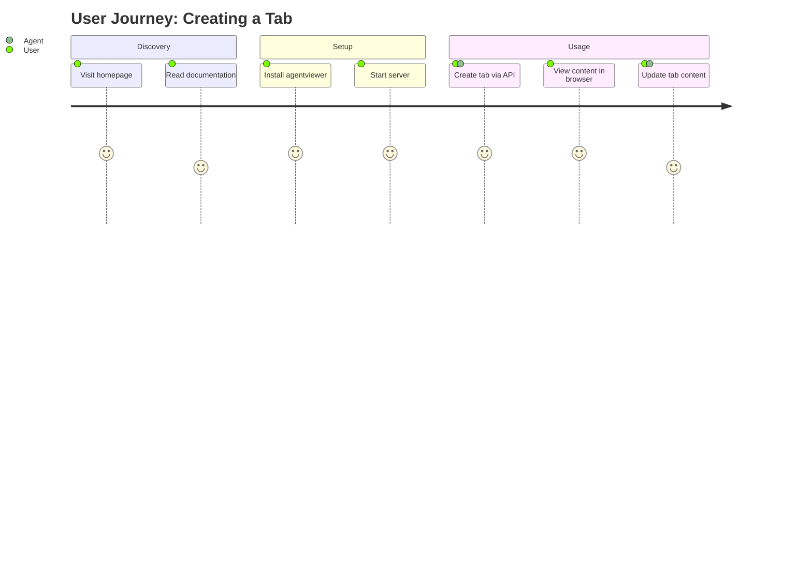
```mermaid
journey
    title User Journey: Creating a Tab
    section Discovery
      Visit homepage: 5: User
      Read documentation: 4: User
    section Setup
      Install agentviewer: 5: User
      Start server: 5: User
    section Usage
      Create tab via API: 5: User, Agent
      View content in browser: 5: User
      Update tab content: 4: User, Agent
```

## 15. Mindmap

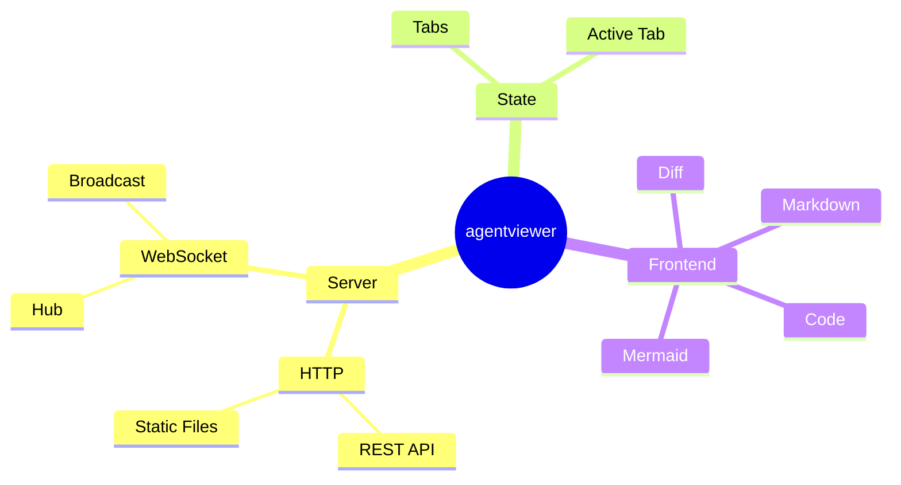
```mermaid
mindmap
  root((agentviewer))
    Server
      HTTP
        REST API
        Static Files
      WebSocket
        Hub
        Broadcast
    State
      Tabs
      Active Tab
    Frontend
      Markdown
      Code
      Diff
      Mermaid
```

## 16. Quadrant Chart

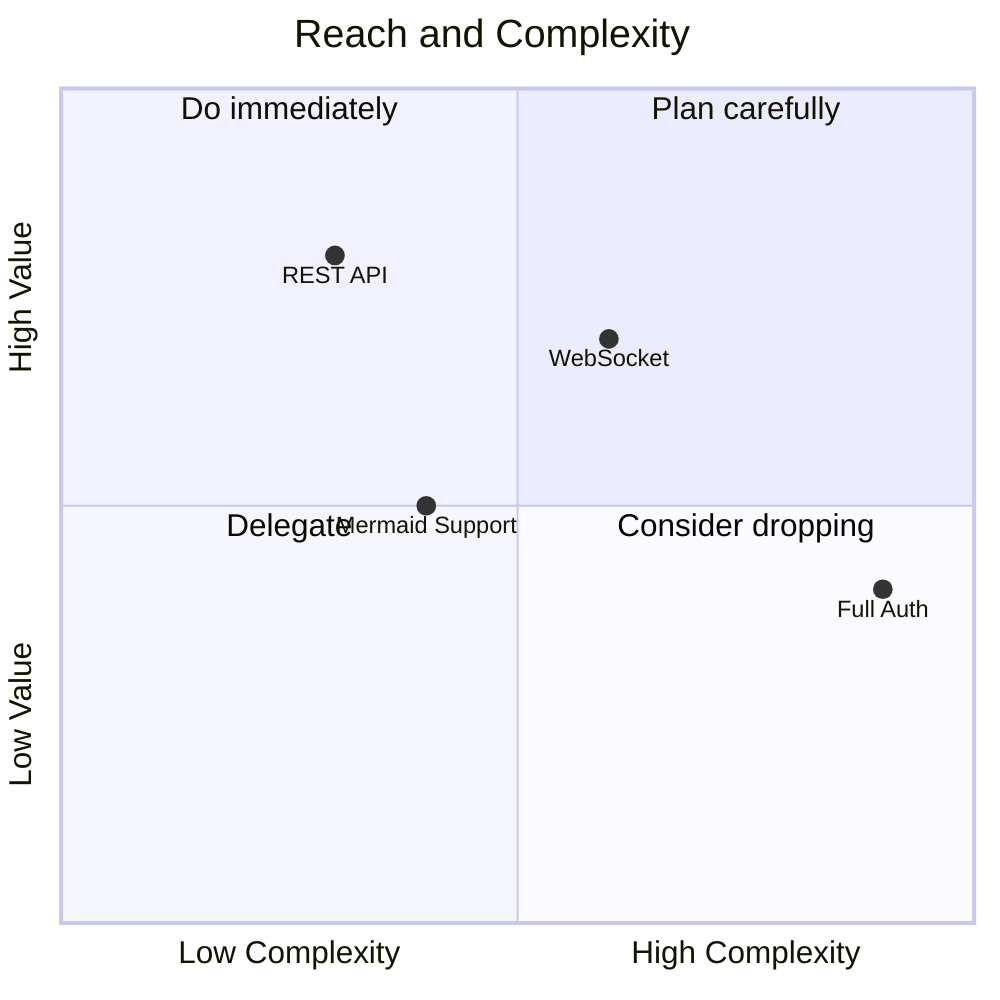
```mermaid
quadrantChart
    title Reach and Complexity
    x-axis Low Complexity --> High Complexity
    y-axis Low Value --> High Value
    quadrant-1 Plan carefully
    quadrant-2 Do immediately
    quadrant-3 Delegate
    quadrant-4 Consider dropping
    REST API: [0.3, 0.8]
    WebSocket: [0.6, 0.7]
    Mermaid Support: [0.4, 0.5]
    Full Auth: [0.9, 0.4]
```

## 17. Timeline

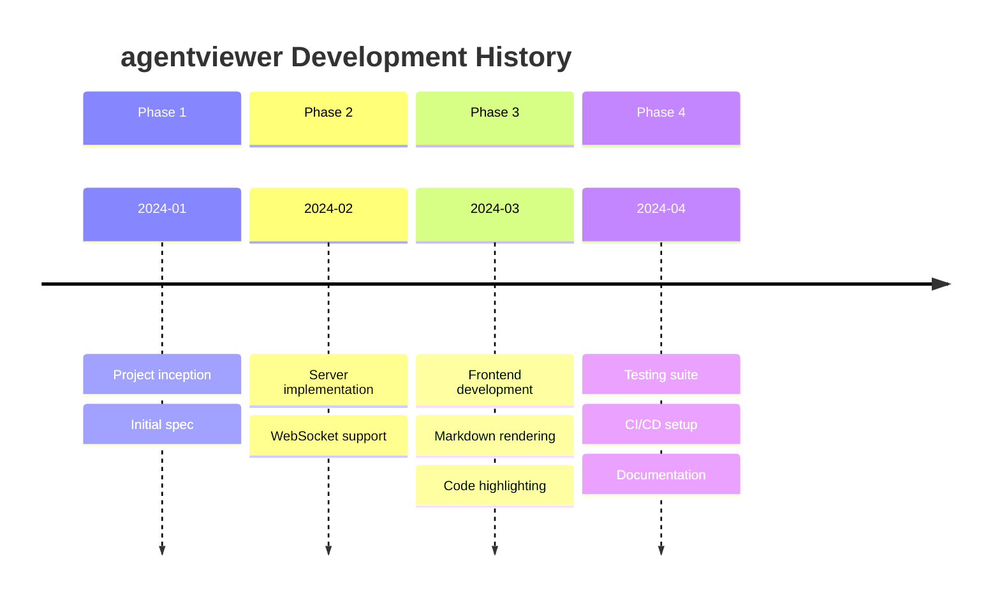
```mermaid
timeline
    title agentviewer Development History
    section Phase 1
        2024-01 : Project inception
                : Initial spec
    section Phase 2
        2024-02 : Server implementation
                : WebSocket support
    section Phase 3
        2024-03 : Frontend development
                : Markdown rendering
                : Code highlighting
    section Phase 4
        2024-04 : Testing suite
                : CI/CD setup
                : Documentation
```

## 18. C4 Container Diagram

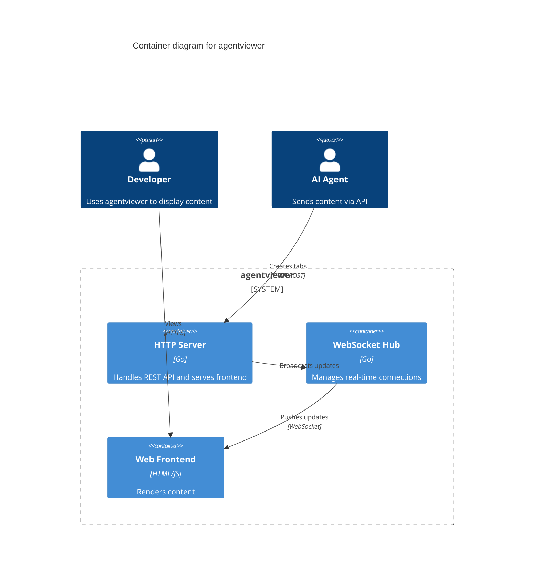
```mermaid
C4Container
    title Container diagram for agentviewer

    Person(user, "Developer", "Uses agentviewer to display content")
    Person(agent, "AI Agent", "Sends content via API")

    System_Boundary(av, "agentviewer") {
        Container(server, "HTTP Server", "Go", "Handles REST API and serves frontend")
        Container(ws, "WebSocket Hub", "Go", "Manages real-time connections")
        Container(frontend, "Web Frontend", "HTML/JS", "Renders content")
    }

    Rel(user, frontend, "Views", "HTTPS")
    Rel(agent, server, "Creates tabs", "HTTP POST")
    Rel(server, ws, "Broadcasts updates")
    Rel(ws, frontend, "Pushes updates", "WebSocket")
```

## 19. Flowchart with Special Characters

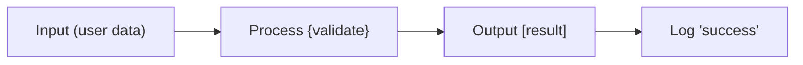
```mermaid
flowchart LR
    A["Input (user data)"] --> B["Process {validate}"]
    B --> C["Output [result]"]
    C --> D["Log 'success'"]
```

## 20. Complex Flowchart with Styles

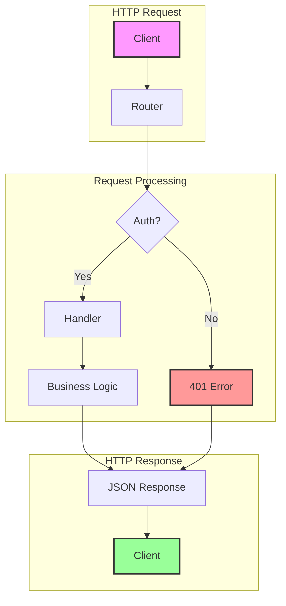
```mermaid
flowchart TB
    subgraph Request["HTTP Request"]
        A[Client] --> B[Router]
    end
    subgraph Processing["Request Processing"]
        B --> C{Auth?}
        C -->|Yes| D[Handler]
        C -->|No| E[401 Error]
        D --> F[Business Logic]
    end
    subgraph Response["HTTP Response"]
        F --> G[JSON Response]
        E --> G
        G --> H[Client]
    end

    style A fill:#f9f,stroke:#333,stroke-width:2px
    style H fill:#9f9,stroke:#333,stroke-width:2px
    style E fill:#f99,stroke:#333,stroke-width:2px
```

## Edge Cases

### Empty Mermaid Block

```mermaid
flowchart LR
    A --> B
```

### Single Node

```mermaid
flowchart TB
    SingleNode
```

### Unicode in Labels

```mermaid
flowchart LR
    A["Start"] --> B["Process"]
    B --> C["End"]
```

### Long Labels

```mermaid
flowchart TB
    A["This is a very long label that might wrap to multiple lines in the diagram"] --> B["Another lengthy description that tests how the renderer handles overflow"]
```
